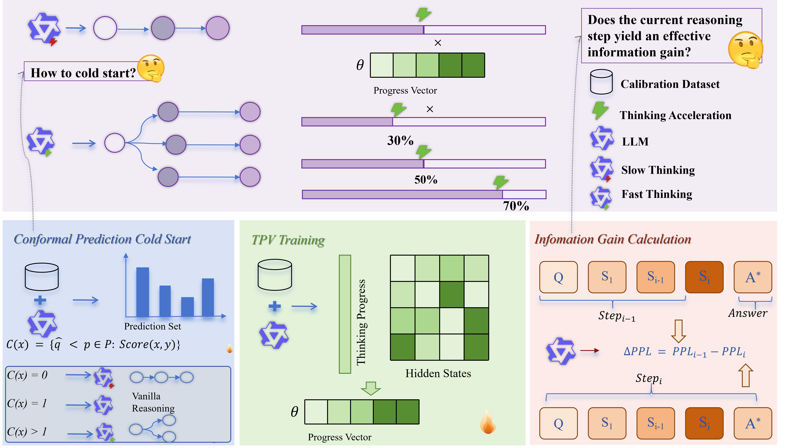

# [IJCAI 2026]Cross Domain Test Time Scaling: Scale knowledge and reasoning on cross domains

## 📖 Method Overview


## ⚙️ Installation

Follow these steps to set up the environment for CR-TTS.

1. Create and activate the conda environment.

```bash
conda create -n crtts python=3.10
conda activate crtts
```

2. For math formulation, Install the required dependencies.

```bash
cd eval/latex2sympy
pip install -e .
cd ..
pip install -r requirements.txt 
pip install vllm==0.5.1 --no-build-isolation
pip install transformers==4.42.3
```

## 📦 Data
Download data under the data folder.
```text
.
├── aime24
│   └── test.jsonl
├── amc23
│   └── test.jsonl
├── GPQA
│   └── test.jsonl
├── HLE(med)
│   └── test.jsonl
├── math500
│   └── test.jsonl
├── Medbullets(op4)
│   └── test.jsonl
├── Medbullets(op5)
│   └── test.jsonl
├── MedQA
│   └── test.jsonl
└── medxpertqa
    └── test.jsonl
```

## 🚀 Quick Start
**Note: we recommend running evaluation scripts with output redirection**, for example,
```bash
nohup bash ./scripts/crtts/eval_base_deepseek_7b.sh >> deepseek-7b-base.log &
```
This makes it easier to monitor progress in real-time and keep track of multiple runs.

## 🎯 Testing
We provide evaluation scripts for evaluating crtts.

To evaluate different models:
- For **DeepSeek-R1-Distill-Qwen-1.5B**:
```bash
cd Silver-Bullet-of-Cross-Domain-LLM-Test-Time-Scaling/eval
./scripts/crtts/eval_linear_deepseek_1_5b.sh
```
- For **DeepSeek-R1-Distill-Qwen-7B**:
```bash
cd Silver-Bullet-of-Cross-Domain-LLM-Test-Time-Scaling/eval
./scripts/crtts/eval_linear_deepseek_7b.sh
```
- For **Qwen3-8B**:
```bash
cd Silver-Bullet-of-Cross-Domain-LLM-Test-Time-Scaling/eval
./scripts/crtts/eval_qwen3-8B.sh
```
- For **GURU**:
```bash
cd Silver-Bullet-of-Cross-Domain-LLM-Test-Time-Scaling/eval
./scripts/crtts/eval_guru_7B.sh
```
- For **Huatuo-O1**:
```bash
cd Silver-Bullet-of-Cross-Domain-LLM-Test-Time-Scaling/eval
./scripts/crtts/eval_huatuo-7B.sh
```
- For **M1**:
```bash
cd Silver-Bullet-of-Cross-Domain-LLM-Test-Time-Scaling/eval
./scripts/crtts/eval_m1.sh
```

